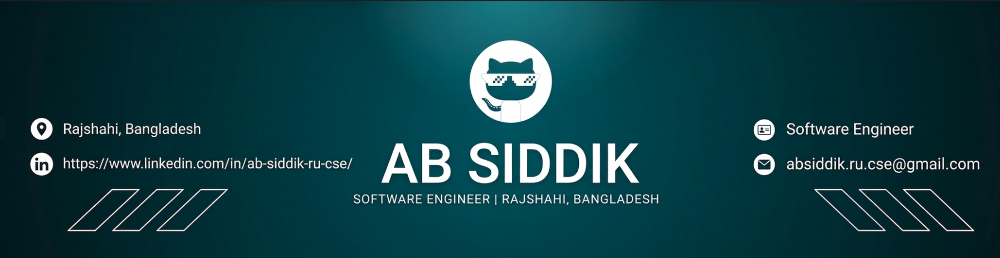

<!-- Banner -->

  

<h1 align="center"> Hi there!  I'm AB Siddik
</h1>

  

<!-- Coding GIF -->

  

---

### 🚀 About Me

I’m a passionate **Full Stack Developer** with a strong interest in building scalable and real-world applications.  
Currently, I’m focused on integrating **Blockchain technology** with modern web solutions to solve practical problems.

- 🔭 Currently working on **Pension Management System using Blockchain**
- 🌱 Exploring and learning **Next.js** and **Blockchain Development**
- 💬 Ask me about **MERN Stack, REST APIs, and Blockchain**
- 🎯 Goal: To build impactful, secure, and user-friendly applications
- ⚡ Fun fact: I enjoy turning complex problems into simple, elegant solutions

📫 Reach me at: **absiddik.ru.cse@gmail.com**

<h2 align="center">🚀 About Me</h2>

  Full Stack Developer passionate about building 
  scalable and 
  real-world applications.

  Currently focused on integrating 
  Blockchain with 
  modern web technologies.

 

🔭 <b>Working on:</b> Pension Management System (Blockchain)  
🌱 <b>Learning:</b> Next.js & Blockchain Development  
💬 <b>Ask me about:</b> MERN Stack, REST APIs, Blockchain  
🎯 <b>Goal:</b> Build impactful & secure applications  
⚡ <b>Fun fact:</b> Turning complex problems into simple solutions  

 

  📫 <b>Reach me at:</b> 
  absiddik.ru.cse@gmail.com

### 🌐 Connect with me

---

### 🧠 Languages and Tools

---

### 💼 Featured Projects

🚀 **Pension Management System (Blockchain)**  
👉 Smart contract based secure pension system  
👉 Built with Hyperledger Fabric  

🌐 **English Learning App**  
👉 Learn vocabulary with pronunciation  
👉 Includes speaking feature  

🛒 **Modern E-commerce UI (Tailwind)**  
👉 Clean & responsive shopping cart design  

---

### 📊 GitHub Stats

  

  

  

---

### ⚡ Activity Graph

  

---

### 🔥 Fun Fact

💡 I love building real-world problem solving apps using **Blockchain + MERN**

---

<!-- Footer -->

  

